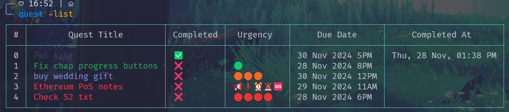

# Todo list CLI tool:
A command-line interface (CLI) tool to manage your tasks or "quests". 

I added a lot of comments because I just started leaning Go and writing notes helps me remember which line is doing what and why.



## Commands and Flags:

| **Flag**           | **Description**                                                                                 |
|--------------------|-----------------------------------------------------------------------------------------------|
| `-add` string      | Add a new quest with `'title : urgency : due date'` (urgency value 0 to 5).                  |
| `-del` int         | Type the quest index to delete (default `-1`).                                               |
| `-edit` string     | Edit a quest by index and other info like `'index : title : urgency : dueDate'`.             |
| `-leftQuests`      | List all remaining (incomplete) quests.                                                      |
| `-list`            | List all quests in a pretty table.                                                           |
| `-toggle` int      | Type the quest index to toggle its 'completed' status (default `-1`).                        |


## Examples:
- Add a new quest:
  ```bash
  quest -add "Eat chicken : 3 : 01 Dec 2024 5PM"
  ```

- Edit a quest (change urgency at index 2 to 4):
  ```bash
  quest -edit "2:-:4:-"
  ```

- List all quests in a table:
  ```bash
  quest -list
  ```

- Delete a quest:
  ```bash
  quest -del 1
  ```

- List all incomplete quests:
  ```bash
  quest -leftQuests
  ```


## Installation:

1. Clone the repository:
   ```bash
   git clone https://github.com/Medushaa/Quest-list
   ```
2. Update the JSON file path in `main.go` to specify where you want to store the quests. For example:
    ```go
    storage := NewStorage[Todos]("C:/YourDirectory/todo-cli-tool/quests.json")
    ```
2. Build the executable in the project directory (for Windows):
   ```bash
   go build -o quest.exe
   ```
3. Add the project directory e.g. `C:/YourDirectory/todo-cli-tool` to your system's environment path variables. 
(`Search > Edit System Environment Variables > Environment Variables > System variables > Path > New`)

Now, you can use the `quest` command globally in your terminal.

---
